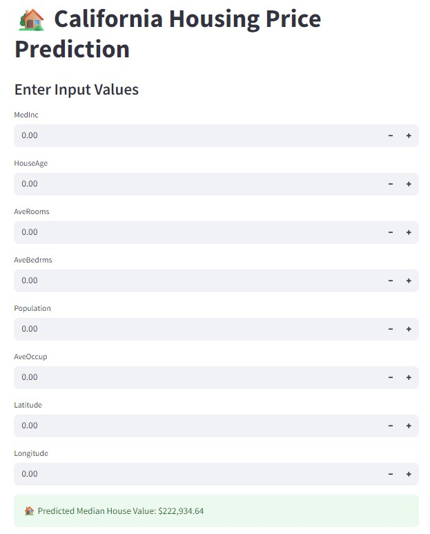

---

# 🏠 California Housing Price Prediction – Advanced Regression Modeling with Streamlit

This project aims to **predict median house prices in California** using machine learning. Leveraging advanced regression techniques and hyperparameter tuning, it provides an interactive tool for exploring housing value trends based on key geographic and socioeconomic factors.

---

## 📌 Business Case

Accurate prediction of housing prices is essential for:

* Real estate market analysis and investment decisions
* Urban development and zoning regulation planning
* Helping buyers and sellers assess property values
* Empowering policy makers with data-driven housing insights

By building a robust predictive model using open California housing data, this app facilitates informed decision-making across stakeholders.

---

## 📊 Dataset Overview

* **Source:** Scikit-learn's California Housing dataset
* **Records:** 20,000+
* **Features Include:**

  * `Median Income`
  * `House Age`
  * `Average Rooms`
  * `Population`
  * `Latitude & Longitude`
  * `Median House Value` – Target variable

---

## 🧠 Project Objectives

* Load and clean housing data
* Perform feature selection using **SelectKBest**
* Standardize numeric columns
* Train a **Random Forest Regressor**
* Tune model using **GridSearchCV**
* Save final model and features
* Build a user-friendly **Streamlit** app for prediction

---

## 🔬 Model Details

* **Algorithm Used:** `RandomForestRegressor`
* **Preprocessing Steps:**

  * Null value checks (N/A in this dataset)
  * Feature standardization using `StandardScaler`
  * Feature selection with `SelectKBest`
* **Optimization:** GridSearchCV with cross-validation

---

## 📈 Performance Metrics

The model was evaluated using:

* **R² Score** – Goodness of fit
* **Mean Absolute Error (MAE)**
* **Root Mean Squared Error (RMSE)**

Results and comparison metrics are available in the notebook and UI output.

---

## 🛠 Tech Stack

* **Language:** Python 3.8+
* **Libraries:**

  * `pandas`, `numpy`
  * `scikit-learn`
  * `joblib` (for model saving)
  * `streamlit` (for interactive UI)

---

## 📂 Project Structure

```plaintext
California_Housing_Advanced_Regression/
├── app.py                   # Streamlit dashboard for predictions
├── model_training.py        # Model preprocessing, training, and tuning
├── regression_model.pkl     # Final trained model
├── model_features.pkl       # Saved list of feature names
├── requirements.txt         # Required Python packages
├── .gitignore               # Version control exclusions
└── README.md                # Project documentation
```

---

## 🚀 How to Run This Project

### 1️⃣ Clone the Repository

```bash
git clone https://github.com/amitkharche/Regression_ML_model_california_housing_random_forest_streamlit.git
cd Regression_ML_model_california_housing_random_forest_streamlit
```

### 2️⃣ (Optional) Create a Virtual Environment

```bash
python -m venv venv
source venv/bin/activate         # On Windows: venv\Scripts\activate
```

### 3️⃣ Install Dependencies

```bash
pip install -r requirements.txt
```

### 4️⃣ Train the Model

```bash
python model_training.py
```

This script saves:

* `regression_model.pkl` – The trained regression pipeline
* `model_features.pkl` – The selected feature columns

### 5️⃣ Launch the Streamlit App

```bash
streamlit run app.py
```

Use the sidebar or form to input values like:

* Median Income
* House Age
* Latitude / Longitude
* Total Rooms

Get instant predictions for **Median House Value**.

---

## 🧪 Sample Prediction Inputs

| Median Income | House Age | Latitude | Longitude | Total Rooms |
| ------------- | --------- | -------- | --------- | ----------- |
| 5.5           | 25        | 34.5     | -118.3    | 2      |

👉 Returns predicted **Median House Price** (e.g., \$230,000)

---

## 🖼️ Streamlit App UI

<p align="center">
  
</p>

---

## 📜 License

This project is licensed under the **MIT License**.
Feel free to fork, use, or extend for educational and non-commercial purposes.

---

## 🙌 Acknowledgements

* [Scikit-learn Datasets](https://scikit-learn.org/stable/datasets/real_world.html) for California housing data
* Contributors of open-source ML and visualization tools

---

## 🔗 Connect with Me

* [🔗 LinkedIn](https://www.linkedin.com/in/amitkharche)
* [📰 Newsletter – From Data to Decisions](https://www.linkedin.com/newsletters/from-data-to-decisions-7309470147277168640/)
* [💻 GitHub](https://github.com/amitkharche)
* [✍️ Medium](https://medium.com/@amitkharche)

---

If you find this project valuable, don't forget to ⭐ the repo and share it with others!

---
